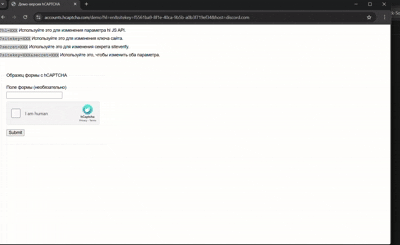
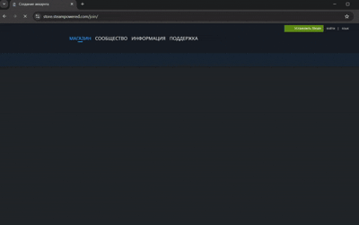

# hCaptcha Click Solver

Asynchronous hCaptcha solver that delegates image classification and human-like mouse
movement to [Multibot](https://multibot.in). The project drives a Patchright (Playwright)
page, replays the exact cursor path returned from Multibot, and applies the provided
answers to hCaptcha challenges.

<p>
  
  
</p>

## Features
- Requests both tile/canvas classifications and mouse movement routes from Multibot.
- Reproduces the returned cursor path step-by-step, including native delays.
- Supports checkbox, grid, canvas, and drag challenges with one entry point.

## Prerequisites
- Python 3.10 or newer.
- Patchright (Playwright fork) Python package: `pip install patchright`.
- Multibot API key. You can obtain one at <https://multibot.in>.

## Getting Started
1. Clone this repository.
2. Install dependencies: `pip install patchright`.
3. Open `main.py` and set `APIKEY` to the Multibot key you received.
4. Run the solver: `python main.py`.
5. The script logs only errors or the hCaptcha token once it is issued.

### Example Usage
```python
import asyncio
import time

from patchright.async_api import async_playwright

from core.logger import log
from core.solver import HCaptchaSolver


APIKEY = "Your MultiBot Key"  # Your MultiBot Key
ATTEMPT = 10  # Number of attempts
INTERCEPT_TOKEN = False  # True - Intercept the token


async def main() -> None:
    async with async_playwright() as patchright:
        browser = await patchright.chromium.launch(headless=False)
        context = await browser.new_context()
        page = await context.new_page()

        #-------------------
        #
        # Your code is here
        #
        #-------------------

        join_url = "https://store.steampowered.com/join/"
        await page.goto(join_url, wait_until="domcontentloaded")

        solver = HCaptchaSolver(
            page,
            APIKEY,
            attempt=ATTEMPT,
            intercept_token=INTERCEPT_TOKEN,
        )

        start_time = time.time()
        token = await solver.solve()
        end_time = time.time()

        if token:
            log.captcha(f"Captcha solved. Token: {token[:35]}", start_time, end_time)
        else:
            log.failure("Couldn't get hCaptcha token", start_time, end_time)

        #-------------------
        #
        # Your code is here
        #
        #-------------------

        await browser.close()
        input("Press Enter to exit...")


if __name__ == "__main__":
    asyncio.run(main())
```

## Project Layout
- `core/` – higher-level solver logic, Multibot API wrapper, and mouse motion helpers.
- `main.py` – usage example that launches a browser, navigates to the demo challenge,
  and runs the solver.

## Notes
- Multibot responses are consumed as-is; the script never alters the returned mouse path.
- Depending on the target site’s anti-bot posture, you may need to rotate or
  fully customise the browser fingerprint (user agent, canvas data, WebRTC,
  WebGL, fonts, etc.) so the intercepted token is accepted.
- Ensure you comply with the terms of service for any website you interact with.
